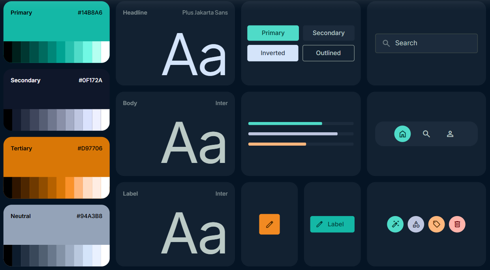

## Brand & Style

This design system is built to evoke the serene, quiet confidence of a high-end outdoor adventure. It balances the rugged nature of van life with a "premium boutique" digital experience. The aesthetic is rooted in **Minimalism** with **Glassmorphic** accents, ensuring that high-quality landscape photography remains the hero while functional UI elements feel like precision tools. 

The primary goal is to foster trust through clean execution while igniting a sense of freedom via wide-open layouts and immersive dark tones. It avoids the cluttered "utility" look of typical rental sites in favor of a sophisticated, editorial approach.

## Colors

The palette is anchored in deep, midnight blues and charcoal slates to create a premium "dark mode" foundation. This depth is punctuated by vibrant teals and earthy ochres that mimic the transition from a forest canopy to a desert sunset.

- **Primary (Teal):** Used for primary actions, success states, and key highlights. It represents the "spark" of adventure.
- **Secondary (Deep Navy):** The core background color, providing a stable, expansive canvas.
- **Tertiary (Earthy Gold/Ochre):** Used sparingly for trust indicators, star ratings, and subtle "warmth" in UI accents.
- **Surface Tones:** A range of low-contrast greys are used for borders and secondary text to maintain a soft, non-aggressive visual hierarchy.

## Typography

This design system utilizes a dual-font strategy to balance character with utility. 

**Plus Jakarta Sans** is the choice for headlines, providing a modern, slightly geometric warmth that feels welcoming and energetic. It features open counters and a friendly structure that excels in large-scale display settings.

**Inter** is the workhorse for body text and functional labels. Its exceptional readability in dark environments ensures that technical rental details and long-form descriptions remain legible. We utilize a slightly increased line height (1.6) for body copy to prevent the "crushing" effect often found in dark-themed UIs.

## Layout & Spacing

The layout follows a **Fixed Grid** philosophy for primary content to maintain a high-end, editorial feel, while allowing hero sections and imagery to bleed to the edges of the viewport.

A 12-column grid is used for desktop (1280px max width) with generous 24px gutters. Spacing follows a strict 8px base unit. Generous vertical "breathing room" (section-gap) is prioritized to ensure the UI feels expansive, mimicking the feeling of the great outdoors rather than a cramped booking engine.

## Elevation & Depth

Hierarchy is achieved through **Tonal Layering** and **Glassmorphism**. Rather than traditional heavy shadows, which can feel "muddy" on dark backgrounds, we use surface lightening and subtle borders.

- **Level 0 (Base):** The deepest navy (`#0F172A`).
- **Level 1 (Cards/Panels):** A slightly lighter navy with a 1px border (10% white opacity) and a very subtle backdrop blur (8px).
- **Level 2 (Overlays/Modals):** More pronounced glassmorphism with a 20% white border and a 16px blur to create a distinct separation from the content below.
- **Gradients:** Primary buttons use a linear teal gradient (45-degree angle) to create a "glow" effect, making them the most elevated and actionable items on the screen.

## Shapes

The shape language is consistently **Rounded**, reflecting the approachable and organic nature of the outdoors. 

- **Cards and Containers:** Use `rounded-lg` (16px) to soften the layout and create a modern, premium feel.
- **Buttons:** Use `rounded-xl` (24px) or full pills to suggest "comfort" and "ease of use."
- **Inputs:** Follow the `rounded-lg` pattern for consistency with cards.
- **Visual Flourishes:** Icons should be contained in circular or soft-edged square containers to maintain the approachable aesthetic.

## Components

### Buttons
Primary buttons feature a teal-to-dark-teal gradient with white text. Hover states should include a slight scale increase (1.02x) and an intensified glow. Secondary buttons are "ghost" style with a thin teal border.

### Cards
Rental cards use a stacked layout: high-resolution image at the top, followed by a dark container with a subtle 1px border. Metadata (fuel, seats, price) should use icons in the primary teal color for quick scanning.

### Input Fields
Dark backgrounds with a subtle border that transitions to a solid teal outline on focus. Labels should be small and uppercase to maintain a "technical/instrument" look.

### Chips & Badges
Small, semi-transparent pills used for "Available" tags or "Instant Booking." They should use the primary color at 15% opacity with 100% opacity text for high contrast without being visually overwhelming.

### Key Custom Components
- **Adventure Map:** A customized dark-mode Mapbox or Google Map with teal pins and simplified terrain.
- **Van Feature Grid:** A set of custom-drawn line icons representing amenities (solar power, kitchen, etc.), using the primary teal color.

